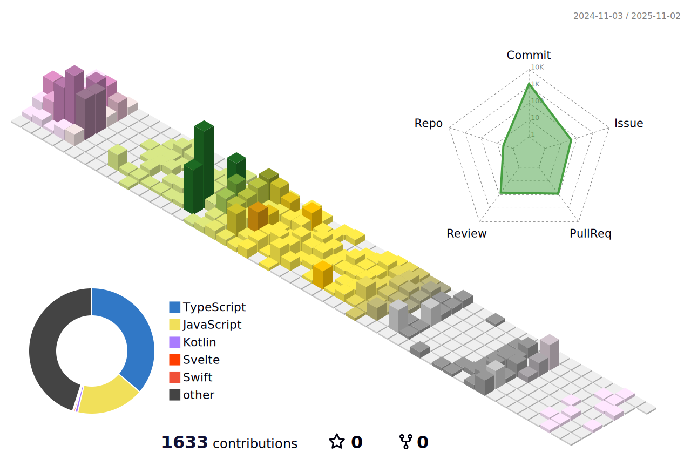

<picture>
  <source 
    media="(prefers-color-scheme: dark)" 
    srcset="https://readme-typing-svg.demolab.com?font=Lobster&color=f0f0f0&center=true&vCenter=true&pause=1500&lines=Hi%2C+there.+I'm+Taeyeon+Yoon.">
  <source 
    media="(prefers-color-scheme: light)" 
    srcset="https://readme-typing-svg.demolab.com?font=Lobster&color=323232&center=true&vCenter=true&pause=1500&lines=Hi%2C+there.+I'm+Taeyeon+Yoon.">
  
</picture>

# 🦏 Creative Habits

👋 Hi, I'm a Web Front-end developer
   

🤔 I'm interested in anything related to computers and eager to learn more.

✨ My goal now is to become a developer who can immediately implement the features and develop meaningful functionalities. 

These days, I'm developing with Next.js 13.4 App Directory version and studying Flutter and Dart as a hobby.

   

# 👨🏻‍💻 GitHub stats

 
    
 
# 📚 Tech stack

  

 

# 🔨 Tools

  

 

# 🔗 Link
👨🏻‍💻 Tech Blog : [Velog](https://velog.io/@okko8522)  

✉️ Contact : 

